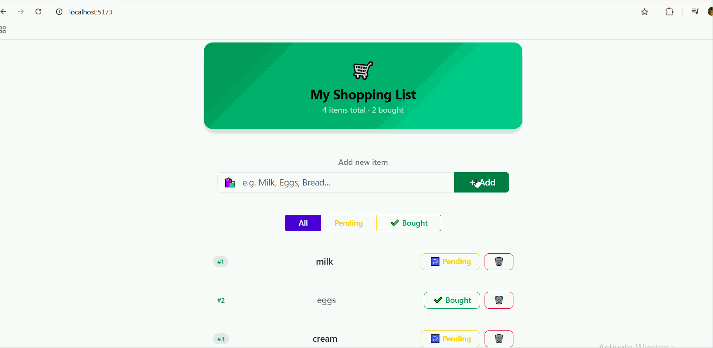
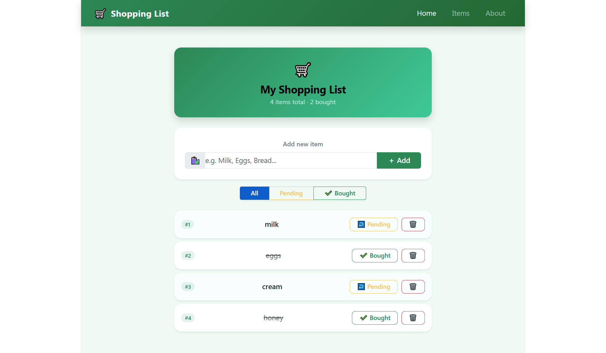

# 🛒 Shopping List App

🚀 A simple and interactive Shopping List App built with React + Vite as part of my front-end development learning journey.

---

## 🌐 Live Demo
👉 https://your-live-link-here.netlify.app/

---

## 🎥 Demo

---

## 📸 Preview

---

## ✨ Features

- ➕ Add items to list
- ✔️ Mark items as Bought / Pending
- 🗑️ Delete items
- 🔍 Filter items (All / Pending / Bought)
- 💾 Data saved using localStorage
- 🔄 Instant UI updates with React state

---

## 🧠 What I Learned

- React components structure
- useState & useEffect hooks
- Props and data flow
- Conditional rendering
- Array methods (map, filter)
- CRUD operations in React
- localStorage persistence

---

## 🛠️ Tech Stack

- React
- Vite
- JavaScript (ES6+)
- CSS

---

## 📌 About This Project

This is my practice project where I learned how React works in real applications.

I used AI tools as a learning assistant to understand concepts, debug issues, and improve my code while making sure I fully understood what I built.

